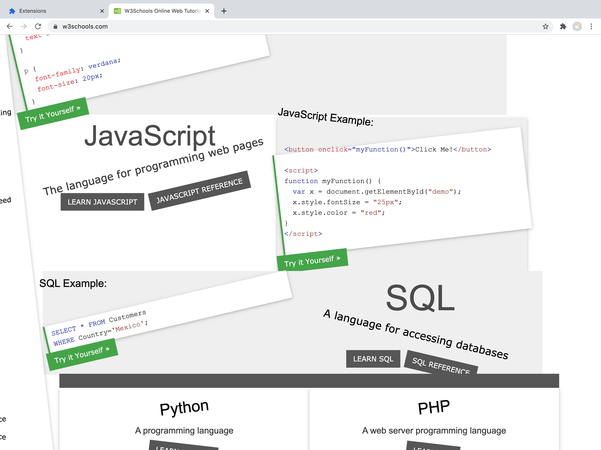

This bug project is a bothersome extension that warps the rotation of every element on the user's page. As the user reaches closer and closer to the bottom of the page, the rate at which the elements rotate should increase, causing a sense of further frustration and anguish to a point at which the site becomes unusable due to the extreme amount each element begins rotating.

I think some further tweaking could be done so the rate of rotation progresses a little more smoothly, but I didn't want to have to make the math too complicated. The extension can be downloaded [here](../bug-project.zip).
